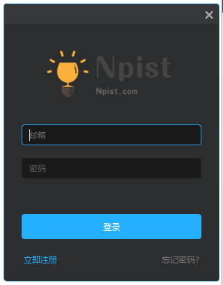
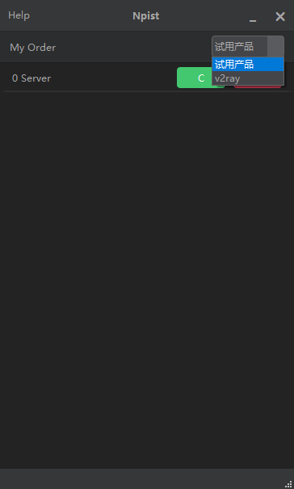
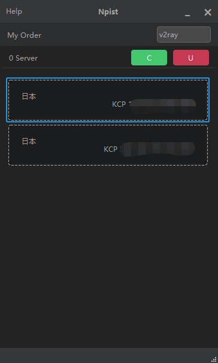
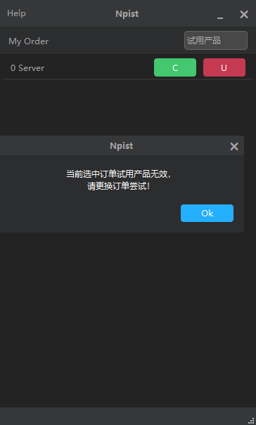

# v2rayMSC 跨平台多用户v2ray客户端
本项目基于v2rayMS项目：https://github.com/Npist/v2rayMS 
使用Python3.6+pyQT5进行开发 
优点跨平台、缺点打包出来程序较大 
UI及CSS参考修改自：https://github.com/892768447/QtSkin 
使用v2rayMS项目的clientapi.php进行通讯 
通讯过程使用RSA加密 
业余练手之作，欢迎交流 npist35@gmail.com 
 
# 进度
界面：50% 
数据交互：80% 
v2ray客户端调用: 0% 
 
# 更新日志
## 2018.10.19
初始版本 
界面基本确定，后续优化及完善中。。 
服务器交互大部分完成 
下次更新不知道什么时候 
 
# 部分截图

# 使用说明
1.使用项目中提供的create_rsa_key.py生成RSA密钥对（建议使用两对） 
2.将生成的密钥对的内容分别对应填写进./CoreInclude/CoreLogic.py及clientapi.php的对应位置中 
3.运行v2rayMSC.py执行主程序（可使用pyinstaller或py2app打包成exe或app） 